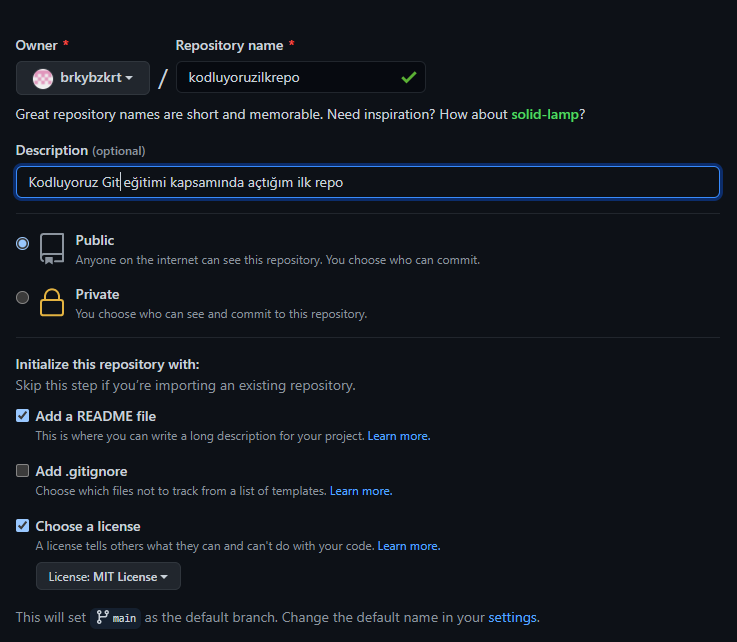

# kodluyoruzilkrepo

Kodluyoruz Git eğitimi kapsamında açtığım ilk repo. 
İçerisinde bir adet html ve README barındırıyor.

 

# Installation

Öncelikle repoyu clonelıyoruz 

```
git clone https://github.com/brkybzkrt/kodluyoruzilkrepo.git
```


# License

[MIT](https://choosealicense.com/licenses/mit/)

